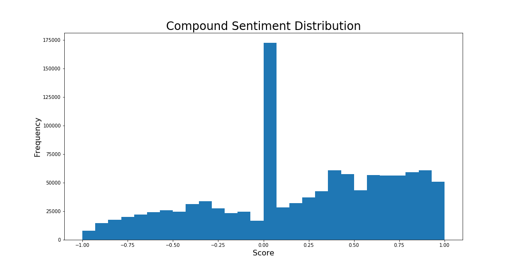
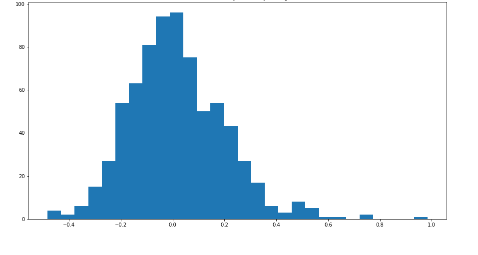
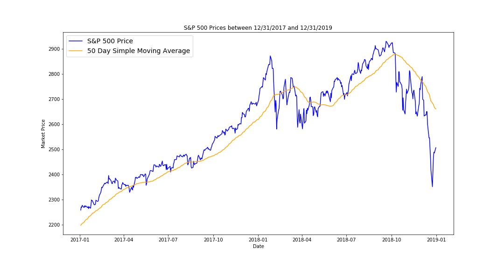
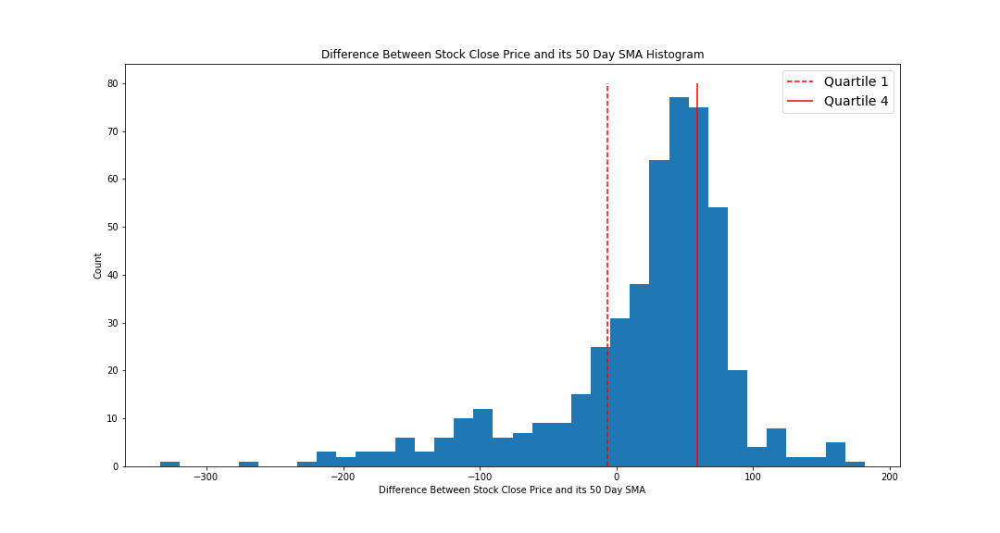
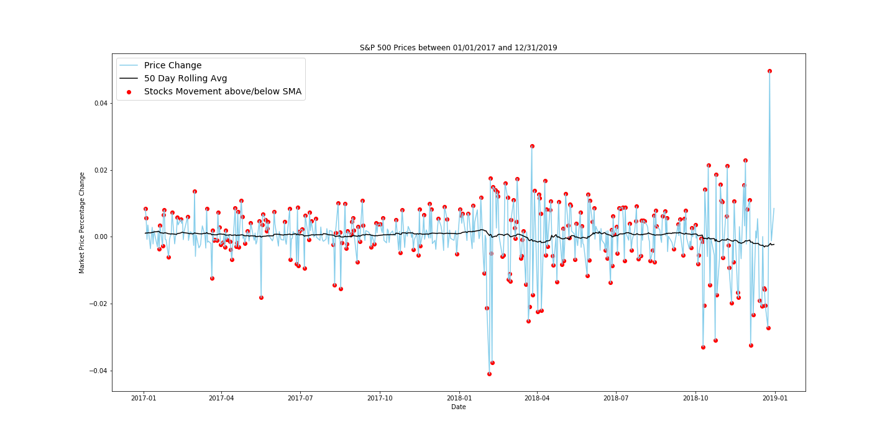
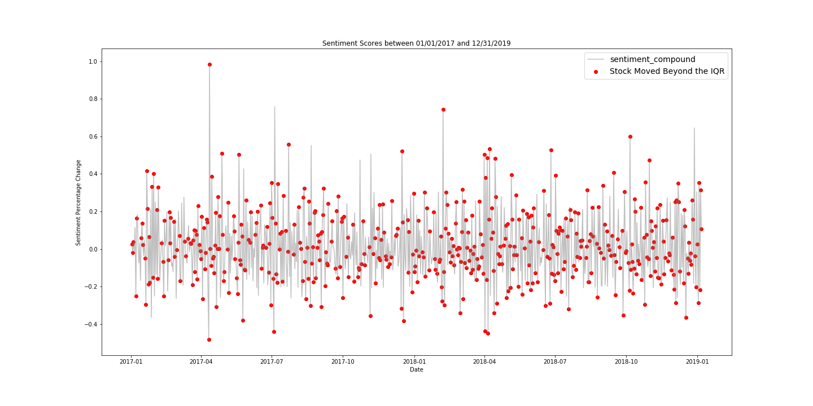
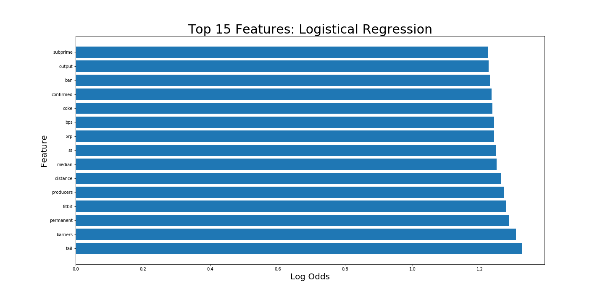
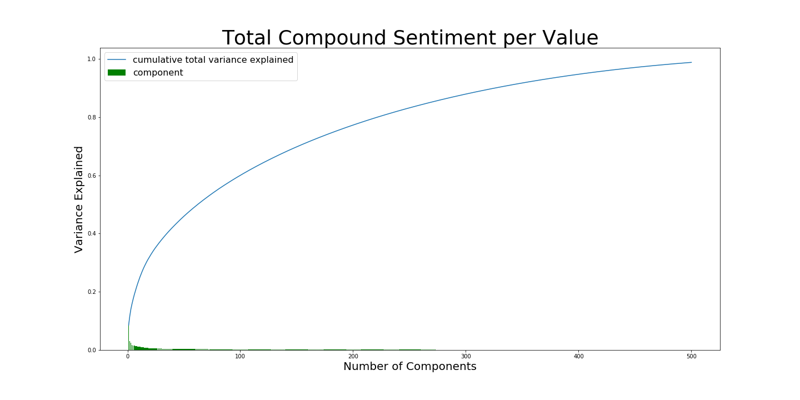

# Technical Report: Classifying Sentiment From Stock Market Moves
___________________________________________________________________

## Problem Statement

Historically, Machine Learning Natural Language Processing (NLP), or deriving Computational meaning from human language, on Internet Content (i.e. Comments from Forums, Twitter, etc.) has been used to attempt to make accurate predictions on Publicly Traded Stocks. 

There are many challenges to approaching this problem. Mainly, the Stock Market generally trades with a lot of noise, or randomly within a range, before showing a true trend and general investors get overly emotional during market volatility. Since investors are usually reacting to market moves, predicting a Stock Market move from something it influences is very difficult.

If this assumption is true, that investors emotions are based on changes in the Stock Prices, then using the Stock Market to predict investor sentiment is a possibility.

The use case for this model is to help Broker Dealers, Investment Fund Companies, and Money Managers maintain strong relationships with their investors. One of the top reasons why clients leave their advisers is the lack of communication or setting expectations:

 "Clients don't necessarily fire advisors only because of performance, but rather because the advisor never communicates with them," (source: https://www.investopedia.com/articles/professionals/071113/why-clients-fire-financial-advisors.asp)

If this model can accurately predict when broad base investor sentiment turns negative, professionals can time their public relations or client outreach, at the right moments of market volatility, to maintain a proactive perception amongst their customer base. 

In addition, the model can also be used to predict positive sentiment to help advisors time when they solicit more business from the excitement of investors.

## Data Collection

Through Pushshift API, I used a function that collected over 1.6 million comments on 4 different investing related Subreddits with over 1.5 million subscribers. This was done over a period of 2 years (2017 - 2018).

Stock market data was collected through Yahoo Finance. I gathered S&P 500 data from the same 2 year time period.

Please note, due to the large data size, these CSV files will not be included in this repository.

## Sentiment Explained

The 1.6 million comment corpus was run using Vader Sentiment Analysis. This pretrained NLP library specializes in Social Media sentiment analysis. 

Positive and negative sentiment is derived from the use of language:

- Positive Sentiment: "This is great, I made so much money" 
- Negative Sentiment: "I can't believe how dumb I was"

Some challenges that traditional models have with social media sentiment:
- "WOW, YOU CAME UP WITH THAT..." (this may appear to be neutral but the all caps and punctuation indicates sarcasm)
- "That is not a bad way to think about it." (the use of not would drive traditional models to believe this comment to be negative, even though it has a slightly positive sentiment)

From the Vader Sentiment Libraries (source: https://github.com/cjhutto/vaderSentiment), Vader Sentiment is specifically designed to combat an older model's bias towards social media content and address:

*examples of typical use cases for sentiment analysis, including proper handling of sentences with:*

- *typical negations (e.g., "not good")*
- *use of contractions as negations (e.g., "wasn't very good")*
- *conventional use of punctuation to signal increased sentiment intensity (e.g., "Good!!!")*
- *conventional use of word-shape to signal emphasis (e.g., using ALL CAPS for words/phrases)*
- *using degree modifiers to alter sentiment intensity (e.g., intensity boosters such as "very" and intensity dampeners such as "kind of")*
- *understanding many sentiment-laden slang words (e.g., 'sux')*
- *understanding many sentiment-laden slang words as modifiers such as 'uber' or 'friggin' or 'kinda'*
- *understanding many sentiment-laden emoticons such as :) and :D*
- *translating utf-8 encoded emojis such as 💘 and 💋 and 😁*
- *understanding sentiment-laden initialisms and acronyms (for example: 'lol')*
- *more examples of tricky sentences that confuse other sentiment analysis tools*

## Exploratory Data Analysis

**Sentiment Distribution**

After evaluating the sentiment, the distribution of Compound Sentiment(on a -1 to 1 scale, from negative sentiment to positive sentiment, respectively):

The overall count looks close to a normal distribution but the mean is equal to the mode at 0 Sentiment (Neutral). Overall, 13% of the the posts were neutral.

Keeping in mind the problem statement, the goal is to predict more polarizing sentiment (extremely positive or negative). This will pose challenges for the model to learn negative and positive sentiment when a large distribution is at 0 or neutral.

When looking at the day-over-day, percentage change in Sentiment:

The distribution is more normal and less concentrated at 0 Sentiment. The mode is still at 0. There are slightly more positive changes than negative changes, in terms of count. The maximum positive score is much higher than the negative score.

| Change in Sentiment | Ratio |
| --- | --- |
| Positive (0) | 0.5088 |
| Negative (1) | 0.4911 |

**Stock Market Analysis**

During the 2017-2018 time period, The market was in a huge uptrend until the very end of 2018. The S&P 500 represents the 500 largest companies and is used as a gauge for the broad based equity markets. This will be the measure for stocks that will be used.

Generally, the S&P 500 was trading above the 50 Day Simple Moving Average(SMA). This trend is used to identify the noise, or the natural range, of the Stock Market.

If we examine days that S&P 500 moved outside the Interquartile Range (IQR, the 2 middle quarters of a distribution),

250 of 735 total days fall under this criteria. We will examine these days to see if they influence Sentiment negatively or positively.

And if examined at the points where they occur relative to the day over day S&P 500 stock chart:

A good portion of the 250 days fall on the peaks and valleys of this percentage change chart.

When reviewed over Sentiment Day Over Day Changes:

Sentiment change is in a tighter range than the stock market but these points to where the stock market moves outside of the IQR. The points look to be more in the noise of the changes in Sentiment Score.

## Strategy

#### The Target:  Change in Sentiment:

(from earlier)

| Change in Sentiment | Ratio |
| --- | --- |
| Positive (0) | 0.5088 |
| Negative (1) | 0.4911 |

- The Baseline Score is 50.9%. Negative Sentiment is Class 1 because of the positively correlated risk to Investment Professionals. Losing clients is very likely without proper outreach in uncertain Market conditions.

- Reddit Comments were analyzed and narrowed down from 1.6 million comments to 557,000 comments (based off word count and relevance) 

- The first model will be on the NLP of the Reddit Comment and properly classifying changing Sentiment

- The second model will be on engineered features of the Stock Market to predict where movement in it can predict changes in Sentiment

Since the Compound Sentiment was derived from the Reddit Comments, I will not be using words extracted from there to help predict with the Stock Market features to predict Sentiment. I want to avoid having elements that are a part of the target.

I am using CountVectorizer and Logistic Regression models as my main tools for NLP. 

CountVectorizer turns frequently appearing words into tokens (variables) that are vectorized (assigned a vector, such as cat = (0, 2) or dog = (1, 3)) to be analyzed. 

Logistic Regression picks continuous probabilities between 0 and 1. It uses the vectorized words to predict the targets and allows interpretation of the features used.

The outcomes from the predictions fall under 4 categories:

- True Positive (tp): The Sentiment changed negatively, and the model guessed Sentiment predicted negatively
- False Positive (fp): The Sentiment changed positively, and the model guessed Sentiment predicted negatively
- True Negative (tn): The Sentiment changed positively, and the model guessed Sentiment predicted positively
- False Negative (fn): The Sentiment changed negatively, and the model guessed Sentiment predicted positively

Accuracy, Sensitivity, and Specificity are the metrics that I will focus on for the validation methods.

- Accuracy: Correct Predictions / All Predictions
- Sensitivity: tp / (tp + fn)
- Specificity: tn / (tn + fp)

For predicting change in Sentiment with Stock Price movement, I will use logistic regression, mainly for interpretability, and eventually use a Recurrent Neural Network (RNN) due to the sequential time aspect.

## Reddit (NLP) Modeling and Results

Using CountVectorizer, I extracted 2000 words (features) that was optimized for the tuned hyperparameters (a value set before modeling). These features were then used as the basis for the Logistic Regression model to learn and predict the Target 1 Class (Negative change in Sentiment) or Target 0 Class (Positive change in Sentiment). 

The data was randomly split into 2 sections:
- 80% Training Set (for the model to learn on)
- 20% Test Set (for the model to predict on)

Two accuracy scores are produced: one for Training and one for Test. The Test score is the primary focus.

The Logistic Regression model scored:
Training Accuracy: 100%
Test Accuracy: 56.0%
Sensitivity: 44.9%
Specificity: 66.3%

| --- | --- | Actual | Class |
| --- | --- | --- | --- |
| --- | --- | Class 1 | Class 0 |
| **Predicted** | Class 1 | 40 (TP) | 32 (FP) |
| **Class** | Class 0 | 49 (FN) | 63 (TN) |

The model was overfitting, meaning it predicted accurately on the Training data, but failed to generalize to unseen data (Test).

Sensitivity suffered due to a relatively high false negative count moreso than Specificity.

The top 15 words that increased the probability of predicting the right target class (i.e. the appearance of the word, "subprime", increased the odds of a statement having negative sentiment by 1.2 times):

Another metric that was used was Receiver Operator Curve (AUC ROC), which measures the overlap between the 2 target classes. The metric is generally between 0.5 and 1 (it is possible to get as low as 0 but that can be fixed). If the score is at 0.5, then your positive and negative distributions completely overlap each other, which is the worst possible outcome.

The AUC ROC score was 0.556, which is fairly close to the worst case scenario.

One way to address overfitting, is to use Principal Component Analysis, a feature extraction method that uses the features that explain a majority of the variance that exists in your data. These will be used to model instead of all the features.

Since 70% of the variance was explained by 150 words, the remaining 1850 words were not used in the second Logistic Regression Model.

The main drawback to this process is that interpretability (versus Logistic Regression, as an example) is diminished. The accuracy scores for the second model were:

- Training Accuracy: 74.4%
- Test Accuracy: 58.7%
- AUC ROC: 0.607
- Sensitivity: 56.2%
- Specificity: 65.3%

There was a 2.7% Test Accuracy (4.8% increase) improvement over the first model. The model performer better than the baseline, 50.9%. The AUC ROC and Specificity improved but with a slight decrease in Sensitivity.

The RNN model was tested but scored worse than the second Logistic Regression model.

## Stock Modeling and Results

The feature engineering I mainly focused on were different rolling averages and metrics for both S&P 500 price changes and volume. This was combined with word counts and comment counts for each corresponding day. Three models were used:

- RandomForest (an ensemble, tree based method that splits on a randomly selected amount of features and splits sections where it attempts to divide the data into homogenous groups)
- Logistic Regression (1 without PCA and 1 with PCA)
- RNN 

A total of 27 Features was used for the 1st Logistic Regression Model.

RandomForest was severely overfitting and scored:
without PCA
- Training Accuracy: 96%
- Test Accuracy: 50%

RNN was also overfitting and scored (8th Epoch):
without PCA
- Training Accuracy: 69%
- Test Accuracy: 56%

Logistic Regression was still overfitting, but has the most interpretability (and suffered less overfitting than RandomForest):
without PCA
- Training Accuracy: 60.9%
- Test Accuracy: 53.8%
- Sensitivity: 69.6%
- Specificity: 38.9%
- AUC ROC: 0.543

| --- | --- | Actual | Class |
| --- | --- | --- | --- |
| --- | --- | Class 1 | Class 0 |
| **Predicted** | Class 1 | 62 (TP) | 58 (FP) |
| **Class** | Class 0 | 27 (FN) | 37 (TN) |

Compared to the NLP models, both suffered from bad AUC ROC scores. Instead of having low Sensitivity, the stock model suffered from low Specificity (high fp).

with PCA
- 11 out of the 27 Features were used
- Training Accuracy: 58.4%
- Test Accuracy: 57.6%
- Sensitivity: 60.7%
- Specificity: 54.7%
- AUC ROC: 0.577

Other than Training Score and Sensitivity, all the other metrics improved. Although the Logistic Regression model with PCA performed better than the baseline, it did worse overall compared to the NLP model.

## Conclusions

The performance of the models did not consistently predict changes in negative and positive Sentiment. There were initial concerns about lack of signal with the variables and targets. This concern appears to be true per the analysis.

This is the Correlation of all numeric Features (not all were used) to Sentiment Score and Target Label (1, 0)

| Feature | Compound Sentiment | Sentiment Label |
| --- | --- | --- |
| word_count | -0.0688 | -0.0716 |
| post_count | -0.0995 | -0.1036 |
| close_SMA50 | -0.0389 | -0.0211 |
| stock_close | 0.102 | 0.1115 |
| stock_SMA50_diff | 0.0547 | 0.0566 |
| volume_SMA50 | -0.0121 | -0.0221 |
| stock_volume | -0.0547 | -0.0541 |
| volume_SMA50_diff | -0.0578 | -0.0368 |
| 5_diff_SMA_50 | -0.0606 | -0.047 |
| 5_diff_stock_close | 0.0508 | 0.0704 |
| 5_diff_stock_vs_SMA50 | -0.0112 | -0.0148 |
| 5_diff_vSMA50 | 0.0111 | -0.0048 |
| 5_diff_volume | -0.0628 | -0.0498 |
| 5_diff_volume_vs_SMA50 | 0.065 | 0.0816 |
| close_1day_vs_5day | -0.0036 | -0.0204 |
| volume_1day_vs_5day | 0.0229 | 0.0105 |
| sp500_5days_after | -0.0774 | -0.0686 |
| sp500_10days_after | -0.0536 | -0.0411 |
| sp500_20days_after | -0.0973 | -0.0787 |
| target | -0.2552 | -0.3126 |
| target_5days | -0.0148 | -0.0426 |
| stock_move_bins_0.0 | 0.0739 | 0.0574 |
| stock_move_bins_1.0 | -0.0461 | -0.0429 |
| stock_move_bins_2.0 | -0.0005 | -0.0038 |
| stock_move_bins_3.0 | -0.052 | -0.03 |
| volume_move_bins_0.0 | 0.0859 | 0.089 |
| volume_move_bins_1.0 | -0.005 | -0.016 |
| volume_move_bins_2.0 | -0.0525 | -0.066 |
| volume_move_bins_3.0 | -0.0566 | -0.0363 |

None of the independent variables have strong correlations (close to 0) to the target.

## Future Steps

- Develop or Improve Sentiment Scoring - Although Vader is a popular social media sentiment analyzer, the way people communicate on the stock market is a little different from general social media. Further research and tuning will be required to improve the precision of the score to reflect sentiment.

- Gather more NLP data - Alternate sources with less moderated discussion need to be explored. More free form text with no initial prompt needs to be collected to generate less neutral speech writing. Any sentiment analyzer will have difficulty with posts that are 50% neutral wording with a mix of other sentiments.

- Add additional individual Stocks and Indices (i.e. Russell 2000) - Although the S&P 500 represents a broad base of stocks, popular stocks and sectors may generate more polarizing sentiment. It is worth exploring how people react to different equities.

## Sources

- **Vader Sentiment Analysis Documentation:** https://github.com/cjhutto/vaderSentiment
- **Vader Sentiment Study:** Hutto, C.J. & Gilbert, E.E. (2014). VADER: A Parsimonious Rule-based Model for Sentiment Analysis of Social Media Text. Eighth International Conference on Weblogs and Social Media (ICWSM-14). Ann Arbor, MI, June 2014.
